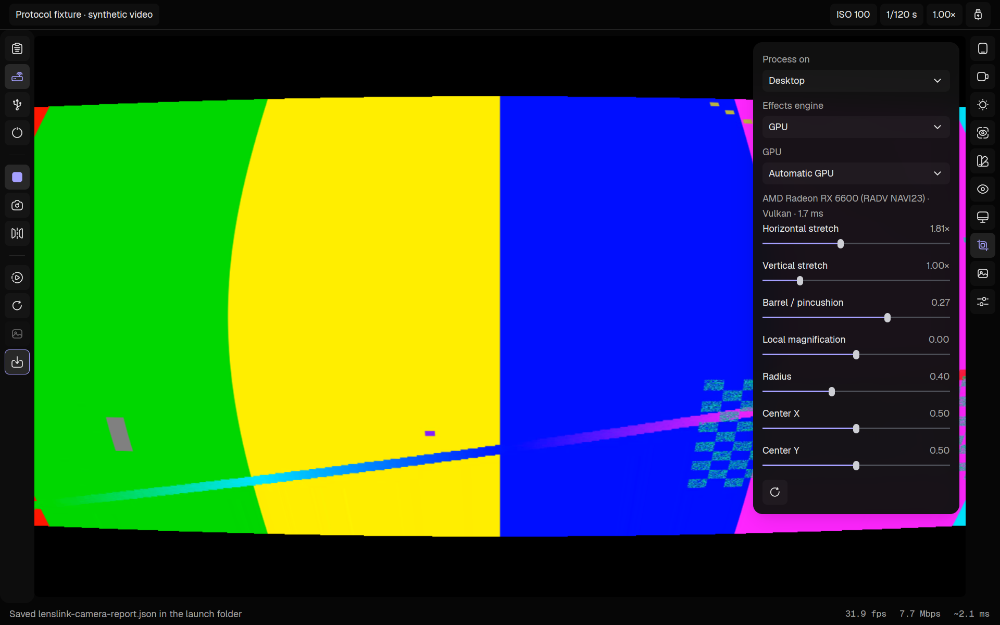

# OpenCam

Open-source Android Camera2 webcam studio. Native Rust/Zui desktop, native Android Material3 companion, USB and encrypted Wi-Fi, hardware H.264/HEVC or uncompressed YUV420/RGBA, automatic transport-format benchmarking and connection recovery. MIT-licensed source.

[Source](https://github.com/DerpcatMusic/OpenCam) · [Downloads](https://github.com/DerpcatMusic/OpenCam/releases) · [Builds](https://github.com/DerpcatMusic/OpenCam/actions/workflows/build.yml)



This is an early version. Linux and Android were built locally; Windows and both macOS architectures have passed native hosted builds and packaging checks. Linux runs protocol, decoder and processing integration checks on GitHub Actions. Real phone hardware, virtual-camera driver integration and glass-to-glass latency still need device testing. Lower lag than Iriun has not been verified.

## Run

Download a package from [GitHub Releases](https://github.com/DerpcatMusic/OpenCam/releases). Linux x86_64, Windows x86_64, macOS Apple Silicon and macOS Intel packages include FFmpeg decoding libraries and the CPU ONNX Runtime. Extract the entire archive; launch `opencam` on Linux, `opencam.exe` on Windows, or `OpenCam.app` on macOS 14+. Linux packages target Ubuntu 24.04 or compatible systems. Windows 10/11 needs the [Microsoft Visual C++ x64 runtime](https://learn.microsoft.com/en-us/cpp/windows/latest-supported-vc-redist). Desktop builds lack Windows publisher signing and Apple notarization. The Android release APK has a persistent project signing key; Actions pull requests produce a debug APK instead. Intel Macs bundle ONNX Runtime 1.23.2, the last available Intel prebuilt; the other desktop packages bundle 1.30.0. Both support the binding's API 22, checked during packaging.

OpenCam uses `dev.opencam` on Android and `opencam://` pairing links. The earlier Lenslink prototype is a separate app: install both OpenCam builds and pair again. Existing Lenslink settings are not migrated.

1. Install the APK on an Android 11+ phone. Open OpenCam and grant Camera permission for local preview. The vertical icons open camera, format, sensor and phone effects controls. Open the connection icon, optionally enable Password protection and set a password, then enable the connection. Keep it open while streaming; backgrounding it stops the camera and server.
2. The desktop discovers enabled phones with native Android NSD / mDNS on the local network. Select a phone; enter its password first if protected. A direct pairing link works as a fallback: copy it into the desktop field using the clipboard button or Ctrl/Cmd+V. Hover actions to see their labels.
3. For Wi-Fi, put both devices on the same reachable network and press the Wi-Fi icon. The phone listens on TCP 4937. A guest network/client isolation or firewall can block it. Pairing works without internet or a cloud account.
4. For USB, install Android platform-tools (`adb`), enable USB debugging on the phone, authorize this desktop, and press USB. The desktop allocates and removes its own ADB forward. `--serial DEVICE_ID` chooses a device if several are attached.
5. Pairing starts the live camera automatically. Use the vertical tool icons for lenses, format, exposure, focus/zoom, white balance, monitoring and virtual-camera output. Resolution and FPS are editable comboboxes: type a value and press Enter/check, or open the arrow for choices. Sensor sizes must be advertised; Output accepts custom even dimensions. ISO, shutter, focus, zoom and torch apply live without restarting the stream. Apply stream commits bitrate changes.

Enabled phones advertise a temporary token and certificate pin over mDNS. **With password protection off, anyone on a reachable local network can connect while the app is enabled.** With protection on, both USB and Wi-Fi require the password even when the pairing link is known. Disabling the phone connection revokes that token. USB forwarding uses the same pinned TLS connection as Wi-Fi.

Discovery works across Wi-Fi and Ethernet on the same LAN and on shared hotspots if multicast and client-to-client traffic are allowed. It does not bypass OS firewalls, router guest isolation or separate subnets. The desktop opens an outbound TCP connection to the phone; no internet/cloud relay is involved. mDNS uses UDP 5353, video uses TCP 4937. USB is the fallback when the network blocks traffic.

Password authentication uses PBKDF2-HMAC-SHA256 (210,000 rounds, random salt) and a fresh HMAC challenge bound to the TLS certificate. The password is never sent as plaintext. Android keeps a derived credential in app-private storage with backups disabled; the desktop keeps the entered password in memory. Missing/wrong credentials are rejected before camera capabilities or video. Turning protection on/off or changing the password stops an active connection; re-enable it to apply the new gate. Open discovery is unauthenticated; for identity assurance, compare/use the pairing link copied directly from the phone. These checks have functional tests, not an independent security audit.

Phone and desktop camera controls share acknowledged settings: pairing adopts the phone's selected lens and sensor mode, edits on either device update both interfaces, and revision checks reject stale desktop writes. Local preview runs without an encoder until the desktop requests a stream. Disabling the connection leaves local preview available; backgrounding the app closes both capture and server. Phone-side GLES effects appear in its preview and encoded video. Heavy desktop effects are visible on the desktop/output; the phone does not receive a return video stream. Editing phone effects transfers processing to the phone.

The [competitor analysis](docs/competitors.md) records MCP REA observations from Iriun Linux 2.9.3, Camo's documented baseline, unknowns and a fair hardware benchmark plan.

## Controls

| Control | Behavior |
| --- | --- |
| Lenses | Public Camera2 IDs and physical sensors routed through logical cameras; no hardcoded Nothing IDs |
| Sensor resolution / FPS | Format-specific advertised encoder/YUV/texture sizes, all integer rates within valid regular ranges, resolution timing limits and advertised fixed high-speed modes; hardware is the final validator |
| Output resolution | Editable combobox: Source, 16:9, 4:3, 1:1, 9:16 and 3:2 presets, plus custom even dimensions |
| Fit / Crop / Stretch | Preserve aspect with bars/crop, or deliberately stretch to the selected output dimensions |
| Stretch / distortion | Phone or desktop GPU horizontal/vertical stretch, barrel/pincushion, local magnification with center/radius |
| Background blur | Phone or desktop person segmentation, GPU blur/compositing, mask-rate control and backend benchmarking |
| Camera ISP | Advertised noise reduction, edge enhancement, chromatic aberration and lens-correction modes |
| Transport format / bitrate | Discovered hardware H.264/HEVC encoders, or uncompressed 8-bit YUV420/RGBA; bitrate applies to compressed formats |
| Gauge | Tests encoders and uncompressed formats at the current resolution/FPS/processing settings; unsupported combinations are reported |
| Sun / ISO / shutter | Auto/manual exposure, sensitivity and exposure time within advertised limits; shutter angle presets convert to sensor exposure time |
| Exposure / lock | Compensation and exposure lock where available |
| Focus / zoom | Continuous-video autofocus or manual diopters, and zoom ratio/crop |
| White balance | Advertised presets, lock and separate R/G-even/G-odd/B gains |
| Stabilization / torch | Optical or electronic stabilization (including Android preview stabilization when exposed), plus torch |
| Rotate / mirror | Applied to both desktop preview and virtual-camera frames on every platform |
| Monitoring | Preview-only luminance histogram, zebra thresholds, focus peaking, false color and thirds guides; never burned into the camera source |
| Photo | Choose an advertised RAW size; DNG is saved to `DCIM/OpenCam` and transferred to the paired desktop launch folder. Capture pauses briefly and resumes automatically |
| Download | All advertised characteristics, latest capture metadata, settings and codec results in `opencam-camera-report.json` in the launch folder |
| Monitor | Direct virtual-camera output switch and driver status |

In Phone processing mode, the desktop requests custom output dimensions from the phone. The phone GPU performs aspect fit/crop/stretch before encoding; the selected codec must support those output dimensions/rate. Sensor acquisition remains at an advertised sensor resolution. Rotate and mirror also run on the phone when its GPU stage is active. The diagnostic probe retains a libswscale fallback for older/fixture streams. Maximum output is bounded to 8192 pixels per axis and 160 MiB per frame, further limited by the phone GPU and codec.

Geometry and blur palettes have a **Process on: Phone / Desktop** selector. Desktop mode keeps sensor/ISP controls on Camera2, disables the phone's software effects, and processes decoded frames on the PC before both preview and camera output. It supports custom output dimensions independent of phone encoder sizes.

Desktop effects use Rust `wgpu` compute: Vulkan on Linux, DirectX 12 on Windows and Metal on macOS, covering compatible NVIDIA, AMD and Intel adapters. Pick an adapter and GPU/CPU explicitly, or Auto to measure both on the first actual frame. Geometry is one compute pass; blur is separable GPU processing. The CPU path uses parallel Rust rows through Rayon. Buffers and pipelines are reused until dimensions change. A bounded worker keeps the latest pending frame; slow work drops pending frames rather than accumulating delay. Timings include GPU upload/readback. This version still decodes on CPU and reads processed pixels back for the native camera driver and Zui preview; it is not a zero-copy pipeline.

Desktop ML uses the bundled Apache-2.0 ONNX conversion of the same 256×144 person model through `ort` / ONNX Runtime. Auto warms and measures the installed providers and picks the fastest successful one. Choices include CPU, NVIDIA CUDA, AMD MIGraphX/ROCm, Intel OpenVINO, DirectML and Apple CoreML. The packaged CPU runtime works without a GPU inference SDK. For a GPU provider, set `ORT_DYLIB_PATH` to an ONNX Runtime library built with that provider and install its matching SDK/runtime libraries. Merely having a GPU driver does not enable CUDA/ROCm inference. AMD's current path is MIGraphX; ROCm availability depends on the runtime version. Unsupported providers report a reason and fall back to CPU. Inference has one job in flight, runs separately from video, and a source mask older than 500 ms is discarded. Missing/expired masks keep the entire frame blurred. Camera exports include the actual backend, timings, dropped frames and provider results. Hardware backend coverage is not claimed without running it.

Manual white balance first needs an automatic preview on the same lens: its measured color-correction matrix is retained. High-speed sessions require automatic exposure, focus and white balance. RAW capture, manual controls and physical-camera routing depend on the phone's Camera2/HAL support. Metadata includes physical-camera results when the HAL returns them. Some complex/vendor values are exported as their Android string representation.

Android firmware determines which sensors, RAW outputs, controls and vendor keys third-party apps can access. This app cannot expose OEM-hidden cameras or the proprietary Nothing camera application's processing modes. It exports the entire advertised characteristic catalog, rather than guessing device models or lens counts.

## Webcam output

OpenCam sends processed video frames directly to an installed virtual-camera driver. Select that camera as a **Video Capture Device** in OBS or as the camera in Zoom/Meet. OpenCam's controls, window and monitoring aids are never part of the source. OBS does not need a window-capture scene.

- **Linux:** install `v4l2loopback` for your running kernel and the system `ffmpeg` command (`sudo apt-get install ffmpeg` on Debian/Ubuntu). Load the driver with `sudo modprobe v4l2loopback card_label=OpenCam exclusive_caps=1`. OpenCam detects a virtual loopback node automatically; `--v4l2 /dev/video10` selects one explicitly. Your user needs write permission. The FFmpeg command converts BGRA to YUV420P for the driver; the bundled decoding libraries cover the preview.
- **Windows:** install the open-source [Unity Capture driver](https://github.com/schellingb/UnityCapture), then select **Unity Video Capture** in the receiving app. The native C++ shared-memory sender feeds processed frames directly; no Python or OBS process is needed. One sender per driver instance.
- **macOS 13+:** install OBS 30+ and activate its Camera Extension in System Settings (starting/stopping Virtual Camera in OBS triggers installation). Close OBS, then select **OBS Virtual Camera** in the receiving app. OpenCam's native CoreMediaIO sender feeds the extension directly. One sender at a time.

The monitor icon opens the output control and driver status. Missing drivers leave preview working and show installation guidance. System drivers need a one-time installation; they are not bundled or silently installed. Driver-supported output sizes may be narrower than the custom preview range. Linux V4L2 and macOS driver runtime were not tested here; the Windows adapter was cross-compiled but not run on Windows.

## Latency and benchmark

With effects off and Source output, the Android path is Camera2 → MediaCodec input Surface → hardware encoder → pinned TLS/TCP. Exposure, focus, zoom, white balance, stabilization and available noise/edge/lens correction use Camera2 requests in the phone ISP. GPU geometry, output sizing, rotate/mirror and background compositing use Camera2 → SurfaceTexture → native EGL/GLES3 → MediaCodec Surface, before transmission. Geometry uses a shader pass without a full-resolution CPU readback. Unsupported high-speed/GPU combinations are rejected; disable GPU effects for constrained high-speed sessions.

Uncompressed YUV420 goes from Camera2's YUV ImageReader to packed I420, bypassing MediaCodec; sensor/ISP controls still run on the phone, while geometry/blur use Desktop processing. RGBA uses the phone GLES stage and an RGBA ImageReader, preserving phone effects without video compression. Both paths require full-frame CPU packing and more bandwidth; they are not zero-copy and are not Bayer sensor RAW. At 1080p30, pixel payload alone is about 746 Mbps for YUV420 or 1.99 Gbps for RGBA, before transport overhead. Use measured results on your link: compression can give lower latency when bandwidth is limited. On Android 13+, chunks carry the Image dataspace; unknown dataspace uses BT.601 limited range for YUV, which still needs hardware color calibration.

DNG transfers use ordered chunks, a 512 MiB limit, generated destination names, a SHA-256 check and an incomplete `.part` file until verified. An interrupted transfer removes the desktop partial file and preserves the phone original. A successful transfer stores the DNG in the desktop launch folder; transfer failure never deletes a completed phone DNG. This is RAW still capture with sensor metadata, not continuous RAW video.

Background blur is off by default. It uses the bundled Apache-2.0 Google Selfie Segmentation landscape model via open-source MediaPipe Tasks, entirely on-device. Only a 256×144 RGBA sample is read back at the selected mask rate; at most one inference is in flight. Auto warms CPU and GPU with two samples, measures three on the first actual frame, and selects the faster available delegate. This is startup calibration, not a broad device benchmark. Video continues while inference runs; a mask older than 500 ms is discarded and the whole frame stays blurred until a fresh mask arrives. Low-resolution separable GPU blur is mixed with the sharp person region. It identifies people, not arbitrary objects, and can miss hair/fingers or moving edges. ML adds startup work, battery/heat and binary size even though its runtime is lazy. Codec benchmarks include the currently selected processing settings.

The desktop decodes access units directly through libavcodec, converts to BGRA and uploads to Zui. There is no video demux subprocess or JavaScript UI. Desktop decode is currently CPU-based; hardware decode and zero-copy GPU textures are not implemented. Live Camera2 changes are sent at most once per 33 ms, and the preview continuously displays their resulting encoded frames. Sensor-result ISO/shutter values appear in the HUD when available. Monitoring aids process only the desktop preview; they add CPU work when enabled.

Capture, network reading, decoding/color conversion, effects and ML are separate bounded stages. Compressed transport holds at most two pending access units; overflow discards dependent video and requests a keyframe. Uncompressed transport holds one pending/in-flight frame and sends 64 KiB chunks, interleaving controls and DNG data. The desktop decode queue holds at most two pending frames, recovers compressed video at a keyframe, and drops old independent pixel frames. Conversion buffers are reused. Preview and the virtual-camera writer retain the latest frame; processing/ML retain one job. A phone write stalled for 750 ms or peer silent for 3.5 seconds closes the connection. TCP retransmission and OS buffers can still delay video on a congested link.

Transient disconnects reconnect automatically, starting at 100 ms and backing off to at most 2 seconds. Each attempt repeats certificate/token/password checks; authentication and malformed-data failures stop rather than loop. Pairing capabilities trigger capture restoration with current phone settings and retained desktop effects. A three-second receive watchdog catches a silent peer; ping/pong bypasses the phone camera handler. The same recovery applies to Wi-Fi, LAN and the existing ADB forward. A restarted phone app creates a new token and needs pairing again. See [transport architecture](docs/transport.md) for the wire contract and failure behavior.

Benchmarking warms each codec for two seconds and measures for five, recording decoded FPS, received Mbps and average estimated frame age. It selects the lowest estimated age among encoders meeting 90% of the requested FPS, or within 95% of the best measured FPS if none meet the target. Without a usable sensor timestamp, it selects by FPS. Failed codecs are reported and skipped.

Frame age is estimated by synchronizing desktop and Android monotonic clocks with the best round-trip sample. It measures sensor/encoder/transport/decode age only when the HAL reports realtime timestamps. It includes phone GPU processing when enabled. It excludes desktop effect processing, UI scheduling and display scanout, and can be biased by asymmetric transport. It is **not glass-to-glass latency** or proof of lower lag than Iriun.

Start with USB, 720p30, H.264, autofocus/auto exposure, stabilization off. Then benchmark at your desired resolution/FPS on the transport you intend to use. A real comparison needs a camera-visible timer/high-speed recording and identical settings in both apps. `docs/synthetic-smoke.json` contains fixture-only measurements, not phone performance.

## Build

Rust 1.98.1 was used here. See the [Zui](https://github.com/zeronsh/zui/tree/dce5c1f737a834b32c2b531d552ea78035e54093) and [FFmpeg binding setup](https://github.com/zmwangx/rust-ffmpeg/wiki/Notes-on-building) for platform requirements. `Cargo.lock` and the Gradle wrapper are included. Honor any shared Cargo target/sccache configuration; run one Cargo build/test at a time.

Linux (Debian/Ubuntu):

```sh
sudo apt-get install build-essential clang pkg-config ffmpeg libavcodec-dev libavformat-dev libavutil-dev libswscale-dev libxkbcommon-dev libxkbcommon-x11-dev libwayland-dev libx11-dev libxcb-shape0-dev libxcb-xfixes0-dev libxcb-randr0-dev libxcb-xinput-dev libegl1-mesa-dev libgles2-mesa-dev libglib2.0-dev libfontconfig-dev
cargo build --locked --release --bins -j 2
# Optional desktop ML runtime, beside the executable:
python3 tools/fetch_onnx_runtime.py /path/to/binary-directory
cargo run --release --bin opencam
```

macOS: install Xcode/developer tools, `brew install ffmpeg pkg-config`, then use the same Cargo commands. Build on the target Mac architecture; this version does not produce a universal app bundle.

Windows: use Rust MSVC and Visual Studio C++ build tools/Windows SDK. Install LLVM and set `LIBCLANG_PATH` to its `bin` directory. Obtain an FFmpeg shared SDK with headers and import libraries, set `FFMPEG_DIR` to the directory containing `include`/`lib`, and add its `bin` directory to `PATH`. Then run the same Cargo build command. Keep FFmpeg's DLLs beside the executable or on `PATH`.

Android: Java 17 and Android SDK platform/build-tools 36:

```sh
# Point Android/local.properties sdk.dir or ANDROID_HOME to your installed SDK.
./android/gradlew -p android assembleDebug
adb install -r android/app/build/outputs/apk/debug/app-debug.apk
```

`.github/workflows/build.yml` tests and packages Linux, Windows, macOS Apple Silicon, macOS Intel and Android using standard GitHub-hosted runners. These runners are [free for public repositories](https://docs.github.com/en/actions/reference/runners/github-hosted-runners#standard-github-hosted-runners-for-public-repositories); no paid/larger runners or external build service is used. Build artifacts expire after seven days. Pushing a `v` tag matching the version in `Cargo.toml` publishes permanent release downloads and SHA-256 checksums only when every platform succeeds. The CPU ONNX Runtime is pinned and checksum-verified; Unix builds bundle a small LGPL FFmpeg decoder and its corresponding source. The Windows LGPL FFmpeg SDK is checksum-verified against its upstream release, with provenance recorded in the package.

Maintainers configure `ANDROID_KEYSTORE_BASE64` and `ANDROID_KEYSTORE_PASSWORD` as GitHub Actions secrets for the persistent Android release key (alias `opencam`). Fork/PR builds use debug signing. For a local signed build, set `OPENCAM_KEYSTORE` to your keystore path and `OPENCAM_KEYSTORE_PASSWORD`, then run `./android/gradlew -p android assembleRelease`. Keep signing material out of Git. Before tagging, update the Cargo version, Android `versionName` and Android `versionCode` together. GitHub Releases do not require an Apple or Windows code-signing subscription. The desktop camera drivers still require their own one-time installation.

## iOS

The iOS companion is not implemented. It needs native AVFoundation camera discovery/control, VideoToolbox hardware encoding and the same authenticated TLS protocol; Android Camera2 and ADB are not iOS APIs. A simulator build can use a free macOS runner. A physical iPhone build must be signed: a free Xcode Personal Team permits personal testing with seven-day provisioning; TestFlight/App Store distribution needs [Apple Developer Program membership](https://developer.apple.com/help/account/basics/about-your-developer-account). No iPhone download is advertised until a real companion exists.

## Verify

```sh
cargo test --locked --bins -j 2
cargo build --locked --bins -j 2
# Resolve the binary path from your Cargo configuration if it uses a shared target directory.
python3 tests/mock_phone.py --probe /path/to/opencam-probe
javac -d /tmp/opencam-tests android/app/src/main/java/dev/opencam/Limits.java android/app/src/main/java/dev/opencam/Auth.java android/tests/LimitsTest.java android/tests/AuthTest.java
java -ea -cp /tmp/opencam-tests dev.opencam.AuthTest
java -ea -cp /tmp/opencam-tests dev.opencam.LimitsTest
# Desktop GPU/model check with the ONNX Runtime beside the executable or ORT_DYLIB_PATH set:
/path/to/opencam-probe --processing-smoke
# Process a real phone stream on the desktop GPU:
/path/to/opencam-probe --pair 'opencam://…' --process-on desktop --backend gpu --stretch 1.4 --background-blur 12 --seconds 10
# Native phone GPU/model checks on a connected test device or emulator:
./android/gradlew -p android assembleDebug assembleDebugAndroidTest
adb install -r android/app/build/outputs/apk/debug/app-debug.apk
adb install -r android/app/build/outputs/apk/androidTest/debug/app-debug-androidTest.apk
adb shell am instrument -w -r dev.opencam.test/dev.opencam.ProcessingTest
```

The integration fixture requires Python, OpenSSL and an FFmpeg build with libx264/libx265. It verifies wrong certificate/token and missing/wrong password rejection before capabilities, streaming decode, custom source/output dimensions/FPS, all four transport formats and benchmark selection, authenticated reconnect, and exact DNG-file transfer. Android instrumentation checks native YUV/RGBA streaming without an encoder, controls/heartbeats during pixels, transfer checksum, stale-frame rejection and preview restoration after an injected RAW failure, plus the existing GLES/model/control checks. Emulator results do not establish physical phone performance or RAW sensor calibration.

With a real enabled phone, `opencam-probe --pair 'opencam://…' --capabilities` exports its full catalog; `--seconds 10` tests video and `--benchmark` tests transport formats. `--codec opencam.i420` or `--codec opencam.rgba` selects uncompressed streaming; `--raw` captures/downloads a DNG when the lens supports it. For probe USB, first run `adb forward tcp:4937 tcp:4937`, then add `--usb`. Remove that manual forward afterward with `adb forward --remove tcp:4937`.

## Source

`desktop/ui.rs` contains the Zui/gpui-base controls; `desktop/session.rs` handles TLS, recovery and the bounded decoder; `desktop/media.rs` validates pixel chunks and DNG downloads; `desktop/webcam.rs` sends direct frames to native camera adapters; `desktop/protocol.rs` validates pairing and packet framing; `desktop/benchmark.rs` measures codecs. `android/app/src/main/java/dev/opencam/` contains the Camera2 catalog, capture/controller, TLS transport and native foreground UI. `desktop/processing.rs` and its `gpu`/`ml` modules own the bounded desktop GPU/CPU and ONNX pipeline. `PhoneProcessor.java` owns the GLES surface pipeline and `BackgroundSegmenter.java` the bounded MediaPipe worker. Third-party dependencies retain their own licenses.

Not implemented: iPhone companion, audio, RAW video streaming, HDR/10-bit video, simultaneous multi-lens streams, OEM-only features, bundled Windows/macOS webcam drivers, hardware desktop decoding, persistent presets and background Android streaming.

## Zeron toolkit and source reuse

The desktop uses [Zui](https://github.com/zeronsh/zui), Zeron's GPUI fork, and
`gpui-base` from [Zeron's gpui-component fork](https://github.com/zeronsh/gpui-component),
pinned to the same revisions as [Zeron](https://github.com/zeronsh/zeron) commit
`0c4835d2b73aa632b7b4d626ee0826a25ec1c9b9`. The compact controls, dark surface
recipe, Geist typography, and native frosted popup code are adapted from Zeron.
Attribution and the retained MIT license are in `vendor/zeron/`; fonts retain
their SIL OFL license. Floating menus use bounded GPU backdrop blur. The live
preview has no decorative blur; monitoring aids are optional.

Camera-specific glyphs are unchanged [Solar Linear icons by 480 Design](https://github.com/480-Design/Solar-Icon-Set), CC BY 4.0; attribution is in `vendor/solar/`. The Windows transport and macOS camera adapter retain their separate MIT notices in `vendor/unity-capture/` and `vendor/mac-virtualcam/`.

MediaPipe and its bundled segmentation model retain Apache-2.0 in `vendor/mediapipe/`, with the exact model source/checksum and model card. Android controls use [Material3 native Views](https://github.com/material-components/material-components-android).
