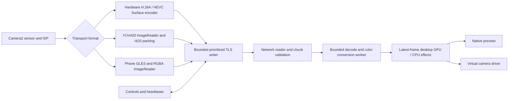

# Capture and transport architecture

OpenCam uses one authenticated, certificate-pinned TLS/TCP connection over Wi-Fi/LAN or an ADB USB forward. Discovery is local mDNS/Android NSD. Network isolation/firewalls still apply; there is no relay.

With phone effects off, encoded capture bypasses GLES. YUV uses phone sensor/ISP controls and desktop geometry/blur. RGBA carries phone GPU effects. ML runs separately with one job in flight and a bounded mask lifetime. Monitoring overlays affect preview only. Driver output and preview receive the same processed camera frames.

## Backpressure and recovery

| Stage | Pending work and overload behavior |
| --- | --- |
| Phone compressed writer | Two access units; discard dependent packets and request a keyframe on overflow |
| Phone uncompressed writer | One queued/in-flight frame; acquire latest camera image and skip packing while busy |
| Phone control writer | 32 packets, prioritized before video and between pixel chunks |
| Desktop decoder | Two pending frames; discard old independent pixel frames, or flush and wait/request a compressed keyframe |
| Desktop effects / ML | One pending frame/job, independently processed |
| Preview / camera driver | Latest processed frame; driver queues may impose additional limits |

Every capture has an epoch. A late encoder output or completed image packing from an old epoch is rejected, including while switching codecs. Mode changes cancel unfinished pixel frames. Heartbeats do not wait for the camera handler or decoder.

Transient I/O failures reconnect at 100, 200, 400, 800, 1600, then at most 2000 ms between attempts. Successful authentication resets the delay. Every attempt rechecks TLS pin, token and optional password; certificate/authentication/protocol/decode errors stop. The desktop adopts current phone capture settings on reconnect and keeps its own processing choices. An app restart changes the phone token and requires pairing again. A three-second receive watchdog detects silent links; the phone closes a write stalled for 750 ms or a peer silent for 3.5 seconds. These limits are recovery policy, not guaranteed end-to-end latency. TCP head-of-line blocking, OS buffers, scheduling, camera exposure and thermal throttling remain.

## Wire framing

All integers are big-endian. A packet is `u8 kind`, `u32 payload_bytes`, then the payload. A packet is bounded to 16 MiB; desktop-to-phone JSON is bounded to 64 KiB.

| Kind | Payload |
| --- | --- |
| 1 | UTF-8 JSON controls, state, metadata, heartbeat or transfer descriptor |
| 2 | `u64 capture_pts_us`, `u32 MediaCodec flags`, encoded access unit; keyframes include codec configuration |
| 3 | `u64 capture_pts_us`, `u32 total_pixel_bytes`, `u32 offset`, `u32 Android dataspace`, up to 64 KiB pixels |
| 4 | 16-byte transfer ID, `u64 offset`, up to 64 KiB DNG file data |

Configured MIME identifies H.264, HEVC, `video/x-opencam-i420`, or `video/x-opencam-rgba`. I420 is packed Y then U then V, 8 bits per sample, chroma width/height divided by two; RGBA is four bytes per pixel. Dimensions must be positive/even, at most 8192 per axis and 160 MiB per frame. Pixel chunks must have the configured exact byte count and contiguous offsets. An offset-zero chunk begins/replaces a frame. New controls may be sent between chunks.

Android plane row/pixel strides are normalized during packing. Android 13+ supplies Image dataspace; older/unknown YUV dataspace falls back to BT.601 limited range. Desktop libswscale preserves the known matrix/range, then converts to BGRA. Conversion buffers are reused. Hardware color/orientation calibration still requires physical devices. CPU decoding/color conversion and GPU upload/readback remain; zero-copy GPU decoding is not implemented.

## RAW stills

Camera2 RAW_SENSOR plus matching capture metadata feed native DngCreator. The selected size must be exposed by that lens. The phone publishes the completed DNG to `DCIM/OpenCam`, briefly pauses capture and restores the previous stream/preview even after a capture failure. Full RAW sensor availability depends on firmware, physical-camera routing and supported Camera2 stream configurations; OEM-hidden modes are not unlocked.

`raw_file_begin` declares a random 16-byte ID, format `dng`, and byte count (at most 512 MiB). Kind-4 chunks have exact contiguous offsets. `raw_file_end` supplies SHA-256. The desktop writes only a generated `OpenCam-<id>.dng.part` name in its launch folder, syncs the verified file and commits it without replacing an existing destination. Disconnect/error removes a partial download and leaves the phone original. File data is interleaved with video chunks; queued controls retain priority. Downloads are not resumable after a disconnect. The destination filesystem must support hard links (normal NTFS/APFS/ext4 do); unsupported/read-only filesystems report an error. DNG still transfer is separate from uncompressed processed-pixel video.

## Evidence

Rust checks cover framing, allocation limits, partial/order/hash validation, decoder color conversion and queue/keyframe recovery. The synthetic TLS fixture tests H.264, HEVC, YUV420 and RGBA, format benchmarks, rejected credentials and reconnect. Native API 36 emulator tests exercise actual Camera2 image surfaces, codec bypass, heartbeats during pixels, DNG-file byte/checksum transfer, captured-frame epoch rejection and preview restoration after an injected RAW failure. A separate native TLS capture produced a 5,177,892-byte DNG from the emulator’s advertised 1856×1392 RAW_SENSOR mode; its downloaded checksum matched and preview resumed. This emulator cannot verify physical RAW_SENSOR fidelity, Nothing firmware, transport latency, thermal behavior or virtual-camera drivers. See [competitor benchmark criteria](competitors.md) before claiming a performance advantage.
